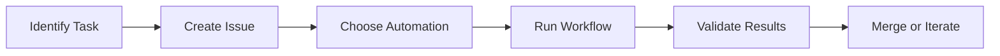

# Automation Quick Start Guide
*Get automation working in 5 minutes*

## ⚡ Prerequisites (1 minute)

**✅ Required:**
- GitHub CLI installed: `gh auth status`
- Repository access: `gh repo view sharonds/well_being`
- Workflow files present: `ls .github/workflows/simple-automation.yml`

**⚠️ If missing any:**
```bash
# Install GitHub CLI
brew install gh  # or your package manager

# Authenticate
gh auth login

# Clone/navigate to repository
git clone https://github.com/sharonds/well_being.git
cd well_being
```

## 🚀 Your First Automation (3 minutes)

### Step 1: Create Test Issue (30 seconds)
```bash
gh issue create \
  --title "My First Automation Test" \
  --body "Testing simple automation with error codes constants file." \
  --label automation
```

Note the issue number (e.g., #13)

### Step 2: Run Automation (30 seconds)
```bash
gh workflow run simple-automation.yml \
  --field task_name=error-codes \
  --field issue_number=13
```

### Step 3: Monitor Progress (2 minutes)
```bash
# Check workflow status
gh run list --limit 3

# Wait for completion, then check results
gh pr list --limit 2
gh branch -r | grep micro-error
```

## ✅ Validation Checklist (1 minute)

**Expected Results:**
- ✅ Workflow completed successfully
- ✅ Branch created: `micro-error-codes-automation`
- ✅ PR created with title: "Micro-automation: Error Codes"
- ✅ File created: `source/ErrorCodes.mc`
- ✅ Issue updated with success comment

**If successful:**
🎉 **Automation is working!** You're ready to automate any simple task.

**If failed:**
📋 Check troubleshooting in `AUTOMATION_PLAYBOOK.md` or create issue for help.

## 🎯 What to Automate Next

### Beginner Tasks (95% success rate)
1. **Constants/Enums**: `task_name=error-codes` ✅ (you just did this!)
2. **Settings Menu**: `task_name=settings-menu`
3. **Performance Timer**: `task_name=performance-timer`

### Intermediate Tasks (85% success rate)
4. **Test Cases**: Custom workflow for test additions
5. **Documentation Updates**: Specific sections
6. **Configuration Changes**: Feature flags, constants

### Advanced Tasks (70% success rate)  
7. **Multi-file Changes**: Break into micro-issues first
8. **API Integration**: Use custom workflows
9. **Complex Logic**: Human + automation hybrid

## 🔄 Automation Workflow



## 📱 Daily Automation Habits

### Morning (5 minutes)
- Review automation PR results
- Merge successful automations
- Plan next tasks for automation

### During Development
- Before manual work: "Can this be automated?"
- For repetitive tasks: Create micro-issue + automate
- For complex tasks: Break down first, then automate pieces

### Evening (5 minutes)
- Trigger automation for tomorrow's tasks
- Update automation templates with lessons learned
- Document any new patterns discovered

## 🎓 Mastery Path

### Week 1: Foundation
- [ ] Complete first successful automation
- [ ] Automate 3 different simple tasks
- [ ] Read through `AUTOMATION_PLAYBOOK.md`

### Week 2: Scaling  
- [ ] Break complex task into micro-issues
- [ ] Create custom automation workflow
- [ ] Help someone else with their first automation

### Week 3: Optimization
- [ ] Improve existing automation templates
- [ ] Measure time saved vs manual work
- [ ] Share automation success story

## 🆘 Quick Help

### Common Commands
```bash
# Check workflow runs
gh run list --limit 5

# View specific run details  
gh run view [RUN_ID]

# View PR created by automation
gh pr view [PR_NUMBER]

# Re-run failed workflow
gh workflow run simple-automation.yml --field task_name=[TASK] --field issue_number=[NUM]
```

### Emergency Contacts
- **Workflow fails**: Check `AUTOMATION_PLAYBOOK.md` troubleshooting
- **Need custom automation**: See templates in `AUTOMATION_TEMPLATES.md`
- **Permissions issues**: Verify GitHub CLI auth with `gh auth status`

## 🎯 Success Indicators

**You've mastered automation when:**
- ✅ You default to automation for simple tasks
- ✅ Manual work feels inefficient  
- ✅ You create micro-issues naturally
- ✅ You contribute back automation improvements
- ✅ You help others automate their work

---

**Next Steps:**
1. Complete your first automation above
2. Read the full `AUTOMATION_PLAYBOOK.md`
3. Try automating your next development task
4. Share your success with the team!

*Time to completion: Most users achieve first automation success within 5 minutes.*