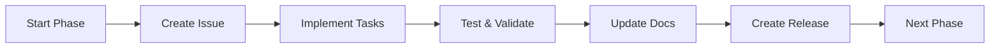

# 📋 Phase Management Guide

## Simple Process for Managing Development Phases

### 🚀 Starting a New Phase

1. **Tell me the phase goal**
   ```
   "Let's start Phase 2: Add real Garmin data"
   ```

2. **I'll automatically:**
   - Create a GitHub issue with checklist
   - Update automation workflows if needed
   - Create feature branch
   - Set up todo list

3. **You review and approve:**
   ```
   "Looks good, continue"
   ```

4. **Automation handles the rest**

---

### 💻 During Development

- **Small tasks** → GitHub Actions automation
- **Complex tasks** → I implement, then commit
- **Testing** → CI runs automatically
- **Reviews** → Copilot reviews PRs

---

### ✅ Finalizing a Phase

1. **Tell me to finalize**
   ```
   "Let's finalize Phase 2"
   ```

2. **I'll automatically:**
   - ✅ Verify all tasks complete
   - 📝 Update all documentation
   - 🏷️ Create release tag
   - 📊 Update progress tracking
   - 🔀 Create PR (if on branch)

3. **One-click approval:**
   - Merge PR
   - GitHub Actions creates release
   - Automation updates CHANGELOG

---

## 📝 Example Workflow

```
You: "Let's start Phase 2: Real Garmin data integration"

Me: Creates issue #34 with:
  [ ] Install garminconnect library
  [ ] Create fetch script
  [ ] Test with your credentials
  [ ] Schedule daily automation
  [ ] Update dashboard-automation.yml

You: "Run automation for task 1"

GitHub Actions: Installs library, creates PR

You: "Continue with task 2"

Me: Implements fetch script, commits

... (repeat until done) ...

You: "Finalize Phase 2"

Me: Tags v1.1.0, updates docs, creates release
```

---

## 🎯 Key Commands

| What You Say | What Happens |
|-------------|--------------|
| "Start Phase X: [goal]" | Issue created, automation ready |
| "Run automation for [task]" | GitHub Actions executes |
| "Continue" | I implement next task |
| "Finalize Phase X" | Release created, docs updated |
| "Check status" | I show current progress |
| "Update docs" | I sync all documentation |
| "Create PR" | I create pull request with changes |
| "Deploy" | I guide you through deployment |

---

## 📊 Phase Status Tracking

Each phase automatically tracks:
- GitHub Issue number
- Task checklist progress
- Commits and PRs
- Test results
- Documentation updates
- Release version

---

## 🤖 Automation Integration

### What Gets Automated:
- **Simple implementations** (< 100 lines)
- **Configuration files**
- **Documentation updates**
- **Test creation**
- **Release management**

### What I Handle Directly:
- **Complex logic** (> 100 lines)
- **API integrations**
- **Security implementations**
- **Architecture decisions**
- **Bug fixes**

---

## 📁 File Structure for Phases

Each phase creates/updates:
```
/
├── .github/
│   ├── issues/           # Phase issues
│   └── workflows/        # Automation
├── source/               # Implementation
├── dashboard/            # Dashboard components
├── tests/                # Phase tests
├── docs/                 # Phase docs
├── CURRENT_STATUS.md     # Auto-updated
├── CHANGELOG.md          # Auto-updated
└── execution_plan.md     # Auto-updated
```

---

## 🔄 Phase Lifecycle



---

## 💡 Best Practices

1. **Keep phases small** - 5-10 tasks max
2. **One goal per phase** - Clear objective
3. **Test as you go** - CI runs on every commit
4. **Document immediately** - Auto-updated
5. **Release often** - Tagged versions

---

## 🚨 Quick Actions

### Need to rollback?
```
"Rollback to previous version"
```

### Need to hotfix?
```
"Create hotfix for [issue]"
```

### Need to check everything?
```
"Run full validation"
```

### Need to clean up?
```
"Clean up workspace"
```

---

## 📞 Getting Help

- **Check status**: "What's the current status?"
- **View progress**: "Show me the todo list"
- **Review changes**: "What did we change?"
- **See documentation**: "Show me the guides"
- **Get next steps**: "What should I do next?"

---

## 🎉 Success Metrics

Each phase tracks:
- ✅ Tasks completed
- 🐛 Bugs fixed
- 📝 Docs updated
- ⏱️ Time spent
- 🚀 Features shipped

---

## Ready to Start?

Just say:
> "Let's start Phase [X]: [Your Goal]"

And I'll handle the rest! 🚀